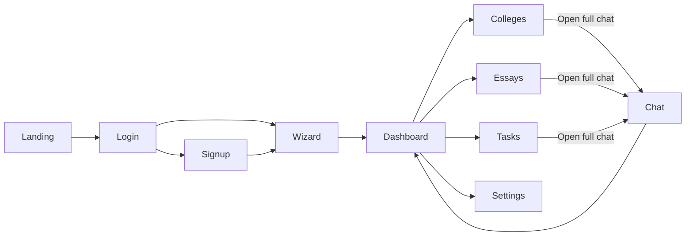

# UniGuide AI – Product Requirements Document

_Last updated: May 30 2025 (Dedicated College · Essay · Tasks pages)_

---

## 1  Product Overview
Unified application hub guiding Chinese families through **college selection, essay production, and deadline management** with bilingual AI support. We focus on colleges and universities in US, UK, HK, Canada and Australia.

---

## 2  Goals & Success Metrics  
*(unchanged)*  

---

## 3  Information Architecture

| Route                | Page                     | Purpose / Key Actions                                                                                             | Auth? |
| -------------------- | ------------------------ | ----------------------------------------------------------------------------------------------------------------- | ----- |
| `/`                  | Landing                  | Hero, value prop, CTA                                                                                             | ❌     |
| `/login` / `/signup` | Auth                     | Email / phone + WeChat OAuth                                                                                      | ❌     |
| `/wizard/*`          | Intake Wizard            | 5‑step guided form, voice input                                                                                   | ✅     |
| `/dashboard`         | Overview                 | Snapshot widgets (progress, upcoming tasks, quick links)                                                          | ✅     |
| `/colleges`          | **College Notes**        | View ranked list, **take & save personal notes** per college, filter & compare drawer                             | ✅     |
| `/essays`            | **Essay Workspace**      | Upload drafts (DOCX/PDF), AI outliner, rich‑text editor, version history. Choose an essay from a school and edit. | ✅     |
| `/tasks`             | **Tasks / Calendar**     | Drag‑drop calendar to add/edit tasks & deadlines; auto‑generated timeline items                                   | ✅     |
| `/chat`              | Full‑Screen AI Concierge | Deep Q&A, brainstorming                                                                                           | ✅     |
| `/settings`          | Profile & Prefs          | Personal data, fit slider                                                                                         | ✅     |
| `/legal/*`, `/about` | Static docs              |                                                                                                                   | ❌     |

> A **Floating Mini‑Chat** component sits bottom‑right on `/dashboard`, `/colleges`, `/essays`, and `/tasks`.  
> All protected routes redirect unauthenticated users to `/login?next=…`.

### 3.1  Navigation Flow (high‑level)

---

## 4  Feature Breakdown

| ID   | Feature                          | Page       | Status  |
| ---- | -------------------------------- | ---------- | ------- |
| F‑01 | Intake Wizard                    | /wizard    | ✅       |
| F‑02 | Match Engine                     | backend    | ✅       |
| F‑03 | Dashboard overview widgets       | /dashboard | **NEW** |
| F‑04 | College Notes (rich text + tags) | /colleges  | **NEW** |
| F‑05 | Essay Upload & Editor            | /essays    | **NEW** |
| F‑06 | Tasks Calendar (CRUD)            | /tasks     | **NEW** |
| F‑07 | Floating Mini‑Chat               | global     | ✅       |
| F‑08 | Full‑Screen Chat                 | /chat      | ✅       |
| F‑09 | WeChat Mini‑Program wrapper      | mobile     | ✅       |

---

## 5  UX Details

### 5.1  College Notes Page  
* Left column: ranked list table (search & filters).  
* Right panel: **Notebook** – markdown editor auto‑saves notes for the selected college.  
* Compare drawer slides from bottom for side‑by‑side KPIs.

### 5.2  Essay Workspace  
* Card for each required essay with “Upload draft” button (accepts DOCX/PDF).  
* Rich‑text editor supports AI suggestions (“Improve tone”, “Shorten”).  
* Version timeline sidebar; click to restore.

### 5.3  Tasks / Calendar  
* Month & agenda views.  
* Auto‑generated events (tests, app deadlines) are **locked** by default; user may adjust dates.  
* **Add Task** modal: title, type (essay, test prep, misc), reminders.  
* Sync toggle to export iCal feed.

---

## 6  Technical Notes (delta)

* Routing: React Router top‑level routes `/colleges`, `/essays`, `/tasks`.  
* **Notes** stored per user & college (Mongo collection `college_notes`).  
* Essay files saved to S3; indexed in `essay_files` collection with version metadata.  
* Tasks persisted in `tasks` collection; cron worker triggers notification automations.

---

## 7  Milestones (re‑scoped)

| Month | Deliverable |
|-------|-------------|
| 0‑1 | New routes scaffolding + nav |
| 1‑2 | College Notes page + API |
| 2‑3 | Essay upload/editor integration |
| 3 | Tasks calendar CRUD |
| 3.5 | Unified mini‑chat across pages |
| 4 | Pilot (20 families) |
| 6 | Public MVP launch |

---
